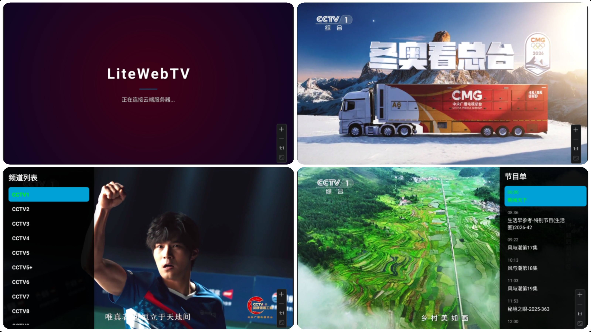

# LiteWebTV 📺

**★ 目标群体：免付费、求稳定、不喜欢折腾的朋友，尤其是给中老年长辈同志。**

> **极简、高性能、沉浸式** —— 专为 Android TV 打造的网页直播容器。

LiteWebTV 是一个基于 Android 原生 WebView 的电视端应用。它不仅仅是一个浏览器套壳，更通过深度定制的 **Kotlin 原生层**与 **JavaScript 注入层** 的双向通信，将网页直播流转化为原生电视应用的流畅体验。

**★ 项目理念**：

🏅 放弃容易失效的 IPTV 直播源方式，直接使用 **yangshipin.cn 网页端电视直播源**。

🏅 **功能纯粹，优雅流畅。** 唯一目的就是启动即可看电视。

🏅 **操作简易，按键合理。** 详见下文✨ 核心特性 -> 2. 🎮 完美遥控器适配 -> 遥控器快捷操作。

<p>

</p>

------

## 🎯 安装使用

### 1. 软件获取途径

- **前往本仓库release页，下载latest安装包。**
- **发行版下载直链（Gitee）** ：https://gitee.com/YukonKong/LiteWebTV/releases/download/1.0/LiteWebTV.apk
- **发行版下载直链（GitHub）** ：https://github.com/YukonKong/LiteWebTV/releases/download/1.0/LiteWebTV.apk

### 2. 安装到电视

- **U盘复制安装包到电视，进行安装。**
- **或 使用野草助手上传安装包后，使用口令下载安装。**
- **或 使用电视浏览器直接下载安装包，进行安装。**
- ...

## ✨ 核心特性

### 1. 🤖 全自动化流程

- **模拟 PC 环境**：伪装 UserAgent，获取 1080P 高清直播流。
- **无人值守注入**：自动检测网页加载状态，脚本自动执行“切换画质”、“开启声音”、“网页全屏”等操作，无需用户干预。

### 2. 🎮 完美遥控器适配

- **原生交互**：重写底层事件分发 (`dispatchKeyEvent`)，拦截 WebView 的焦点抢占。
- **遥控器快捷操作**：
    - ⬆️ / ⬇️：快捷换台（带 3秒 防抖保护）。
    - ⬅️：呼出/关闭 **频道列表**，⬆️ / ⬇️滑动列表，🆗切换所选频道。
    - ➡️：呼出/关闭 **节目单列表**，⬆️ / ⬇️滑动列表。
    - ↩️：可关闭列表，播放界面按两次退出软件。
    - 其余按键：未设计映射逻辑，调用电视原始功能。
- **彻底禁用输入法**：使用自定义 `NoImeWebView`，从根源上切断软键盘弹出，保证纯净的遥控体验。

### 3. 🎨 简约高级感 UI

- **魅影紫呼吸灯开屏**：启动时展示带有“魅影紫”光晕呼吸效果的开屏页，科技感拉满。
- **智能幕布转场**：
    - 换台时，黑色渐变幕布优雅落下，遮挡网页加载时的白屏或闪烁。
    - **Smart Sense 技术**：JS 实时监测视频流状态，一旦视频真正开始播放（`readyState >= 3`），毫秒级触发幕布升起动画，实现无缝衔接。
- **原生 UI 覆盖**：侧边栏使用原生 `RecyclerView` 渲染，半透明磨砂质感，支持焦点记忆与高亮动画。

### 4. 🚀 极致性能优化

- **AdBlock 引擎**：底层拦截 `hm.baidu.com`, `google-analytics` 等统计脚本请求，减少 CPU 占用并提升加载速度。
- **硬件加速**：开启 `hardwareAccelerated` 与 `largeHeap`，确保 4K 电视也能丝滑运行。
- **内存管理**：严格的资源释放策略，防止电视盒子长时间运行后卡顿。

------

## 🆚 技术路线对比：WebTV (本项目) vs IPTV

下表详细对比了本项目的 **WebTV 注入方案** 与传统 **IPTV 抓包方案** 的优劣：

| **特性**         | **🟢 LiteWebTV (本项目)**                                     | **🟡 传统 IPTV 类软件**                                       |
| ---------------- | ------------------------------------------------------------ | ------------------------------------------------------------ |
| **数据源稳定性** | ✅**极高**   直接加载官方网页，只要官网不改版，源永不失效。   | **低**   直播源(m3u8)经常会有防盗链、token过期，需要频繁维护。 |
| **画质与延迟**   | ✅**官方原画**   默认1080P，与官方网页端完全一致。            | **参差不齐**   取决于抓到的源，下限低但是上限较高。          |
| **节目单 (EPG)** | ✅**实时同步**   JS 实时从网页抓取当前节目单，准确无误。      | **滞后/缺失**   需要配置额外的 EPG 接口，经常对不上或者无法显示。 |
| **换台速度**     | **中等 (1-3秒)**   需要加载网页架构和执行 JS，稍慢但有转场动画掩盖。 | ✅**极快 (0.5秒)**   直接拉流，速度最快。                     |
| **维护成本**     | ✅**一次开发，长期使用**   适合极客，无需到处找源。           | **持续折腾**   每隔几天就要到处找新的直播源接口。            |

------

## 🛠️ 项目结构

简要说明，详细信息请自行使用AI工具协助。

```
com.yukon.litewebtv
├── MainActivity.kt        // 核心控制器：处理 UI、遥控器事件、幕布动画、性能拦截
├── ScriptRepo.kt          // 脚本仓库：存放所有注入的 JS 代码 (画质、去广告、数据提取)
├── WebAppInterface.kt     // 交互桥梁：Android 原生与 JS 的通信接口 (JavascriptInterface)
├── NoImeWebView.kt        // 组件重写：被阉割了输入法功能的 WebView
├── TvModels.kt            // 数据模型：ChannelItem, ProgramItem
└── TvAdapters.kt          // UI 适配器：侧边栏列表渲染
```

------

## 📥 安装与调试

1. **参考开发环境**：
    - IDEA 2025.3.2
    - java version "21.0.2" 2024-01-16 LTS
    - 项目Minimum SDK: API 24 ("Nougat"; Android 7.0)
    - 模拟器测试：Television (4K) + API 34 "UpsideDownCake"; Android 14.0 + Android TV Intel x86 Atom System Image
    - 实机测试：雷鸟 鹤7 PRO 25款
2. **构建**：
    - 克隆本项目。
    - 连接 Android TV 或 模拟器。
    - 点击 `Run`。
3. **首次运行**：
    - 应用启动后会显示“魅影紫”开屏。
    - 等待约 3-5 秒，直到画面出现，脚本会自动接管一切。

------

## ⚠️ 免责声明

- 本项目仅供 **技术研究与学习** 使用，旨在探讨 Android WebView 与 JavaScript 的交互技术。
- 所有视频内容均来自第三方公开网站，本项目不提供、不存储任何视频资源。
- 请在下载后 24 小时内删除，支持正版，请下载官方应用。

------

**Developed with ❤️ by Yukon & Gemini 3 Pro**

🌀项目理念即开发**纯粹**的主流频道WebTV播放器，暂不考虑添加任何复杂功能或适配其他网站，有需要者请尽量借助AI工具自行实现改进。

🌀后续随缘更新 ~